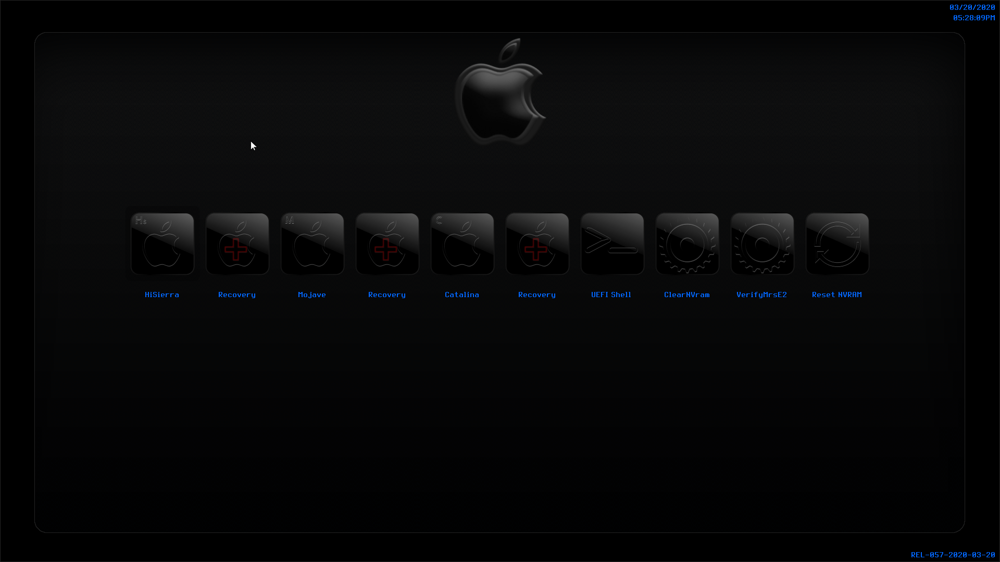
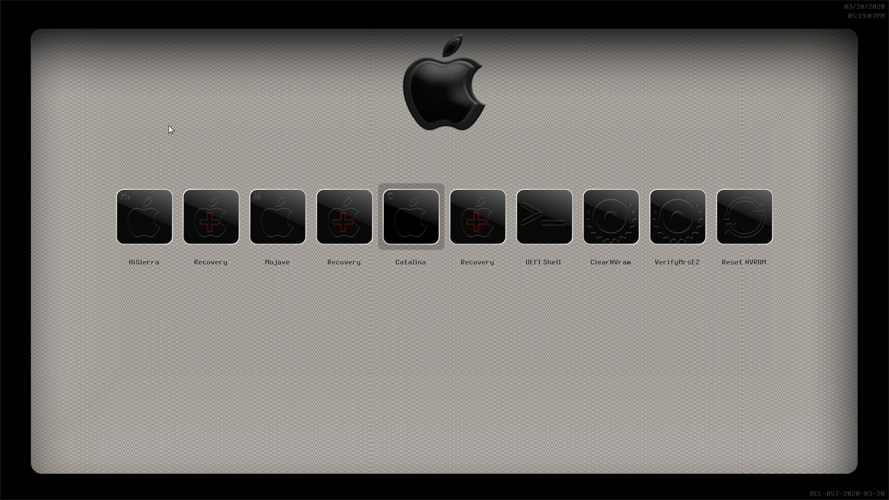
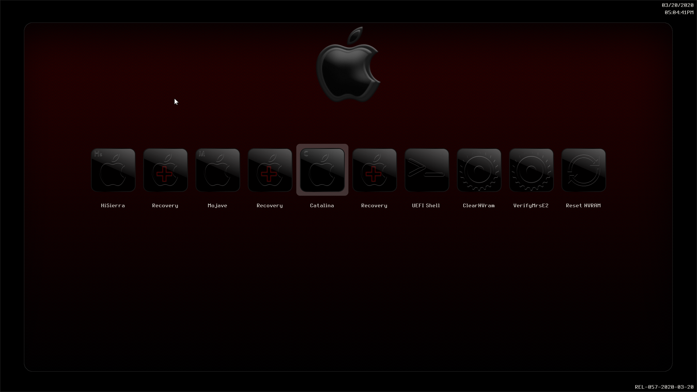

# OpenCoreThemes

My personal Theme for OC

# Opencore

Into Opencore background folder contains 3 colors variations

# Pitch Black

### Black

### NotWhite

### Red

3 variations and more backgrounds inside

# Notice 
Icons for most systems, 
for some extra icons, to show up as they are into the folder, 
you should edit your NdkBootpicker.c or if using ndk branch OcSimpleBootMenu.c
inserting your choice into     
case OcBootXXXX (XXXX matching the menu you need to edit)
