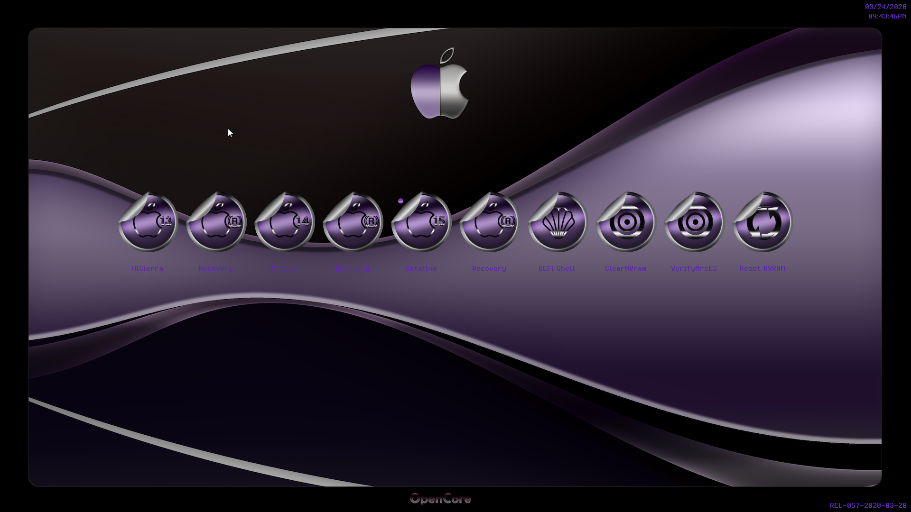

# OpenCoreThemes

My personal Theme for OC
# 
# Opencore
Into Opencore background folder contains 3 colors variations
#

# 
# Silver
This contains 4 variations
#
### Silver Light

#
### Silver Dark

# 
### Silver Violet

#
### SilverSexy

# 
# Abstrac Steel

# 
# Cushion

#  
# Pitch Black 
3 variations
# 
### Black

# 
### DarkGray

# 
### NotWhite

# 
### Red

# 
### Ochre

# 
### Acqua

# 
### Velvet

# 

# Notice 
Icons for most systems, 
for some extra icons, to show up as they are into the folder, 
you should edit your NdkBootpicker.c or if using ndk branch OcSimpleBootMenu.c
inserting your choice into case OcBootXXXX (XXXX matching the menu you need to edit)
# 
### Direct Themes Download
[Here](https://github.com/HelmoHass/OpenCoreThemes/releases/)
# 
