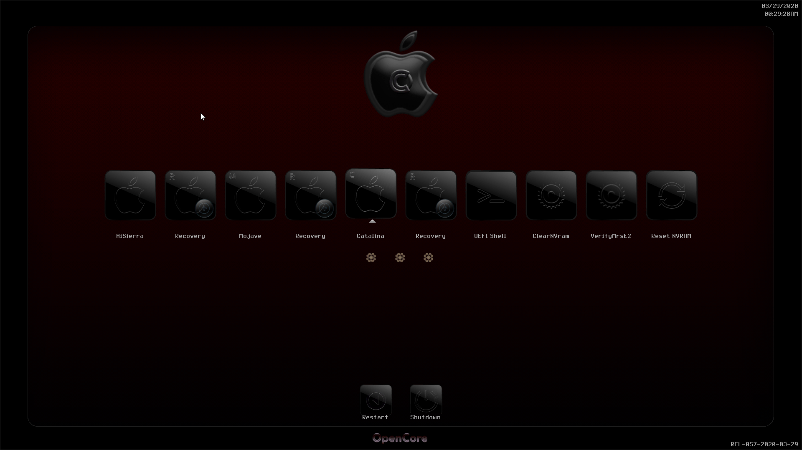

# OpenCoreThemes

My personal Themes for OC
# 
# Opencore
#

# 
# Silver
#
This contains 4 variations
#
### Silver Light
#

#
### Silver Dark
#

# 
### Silver Violet

#
### SilverSexy
#

# 
# Abstrac Steel
#

# 
# Cushion
This contains 3 variations
#
### Cushion Orange
#

# 
for all 3 Themes you have a few alternate icons and fonts to replace if you like better, as shown in pic

there are a few more (this is just for demo)
# 
### Cushion Bluey
#

# 
### Cushion Gray
#

# 
# BloodyCushion
#

#
# Marbles
#

# 
# Pitch Black 
3 variations
# 
### Black
#

# 
### DarkGray
#

# 
### NotWhite
#

# 
### Red
#

# 
### Ochre
#

# 
### Acqua
#

# 
### Velvet
#

# 

# Notice 
Icons for most systems, 
for some extra icons, to show up as they are into the folder, 
you should edit your NdkBootpicker.c and NdkBootpicker.h or if using ndk branch OcSimpleBootMenu.c and OcSimpleBootMenuInternal.h
inserting your choice into case OcBootXXXX (XXXX matching the menu you need to edit)
# 
### Direct Themes Download
[Here](https://github.com/LAbyOne/OpenCoreThemes/releases/)
# 
